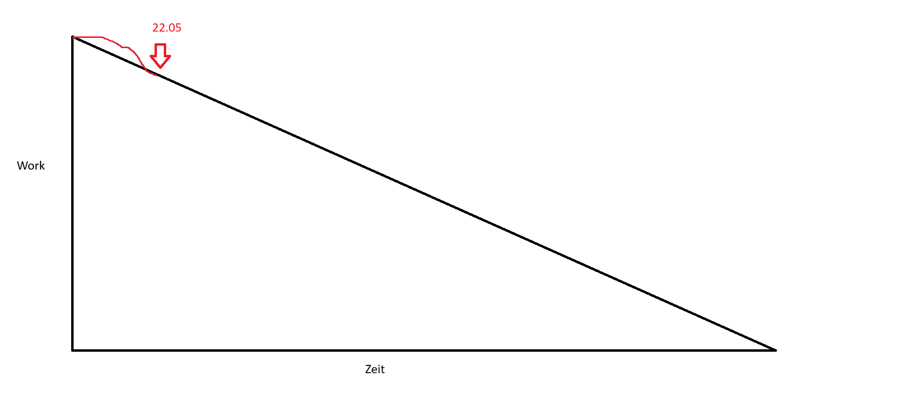

# Daily-Protokoll

### Ladina

War krank
Projekt aufsetzen lokal

### Jan

Db aufgesetzt
DB aufsetzen ging auf server nicht, jetzt lokal
Tabelle und Backend für menüs

### Nevio

Projekt aufgesetzt
Limited knowlage
Frontend für Menü auswahl.

### Simo

Leider Krank

### Matthias

PO resp. SM da Simo krank

# Review

Sprint Backlock ist leer
Alle Issues erfüllen akzeptanzkriterien
Alle Issues sind closed
Neues Product
Backlock:
- Bestullung Getränke
- Online Zahlung durchführen
- Login/Anmelden
- Benutzerkonto erstellen/Login
- Übersicht der Bestellungen
- Admin-PageFeedback:
- Vortschritte zeigen
- Team zeigt PO nicht umgekeht
- Guter Aufbau
- Akkeptanzkriterien abgehakt
- Bisschen mehr nachhaken des POs
- Unrealsitische Szenarien auch machen

